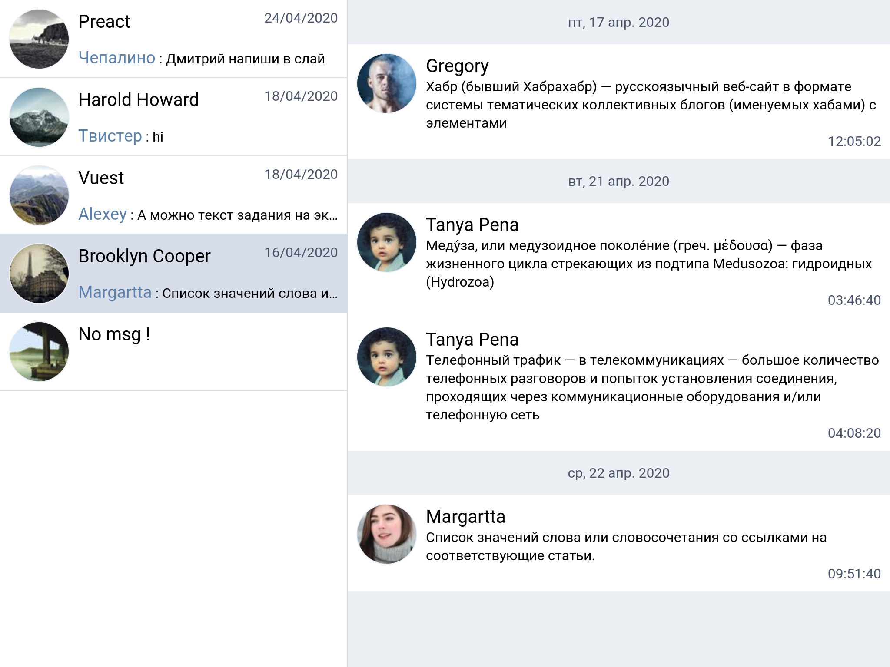

# React-messenger

Frontend messenger created on react.

## Preview

## Interface

[Figma](https://www.figma.com/file/yEx0NIz0U3bcDH5LgeUrQ8/react-messenger?node-id=0%3A1)

## Test stand

[GitHub Pages](https://aengorg.github.io/middle.react.praktikum.yandex/)

## Roadmap

[Trello board](https://trello.com/b/iVXiqLfo)

## Install deps

`npm ci`

## Run dev

`npm start`

## Run prod

`npm run build`

## Tests

`npm test`
